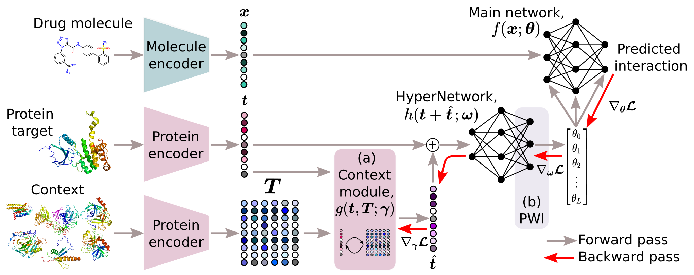

# HyperPCM

[](https://www.python.org/downloads/release/python-390/)
[](https://pytorch.org/get-started/previous-versions/)


A HyperNetwork approach to drug-target interaction prediction.

**[Abstract](#abstract)**
| **[Dependencies](#dependencies)**
| **[Data](#data)**
| **[Usage](#usage)**
| **[Citation](#citation)**



## Abstract

### Robust task-specific adaption of drug-target interaction models

Emma Svensson<sup>1</sup>, Pieter-Jan Hoedt<sup>1</sup>, Sepp Hochreiter<sup>1, 2</sup>, Günter Klambauer<sup>1</sup>

<sup>1</sup> ELLIS Unit Linz and LIT AI Lab, Institute for Machine Learning, Johannes Kepler University Linz, Austria  
<sup>2</sup> Institute of Advanced Research in Artificial Intelligence (IARAI) 

HyperNetworks have been established as an effective technique to achieve fast adaptation of parameters for neural networks. Recently, HyperNetworks conditioned on descriptors of tasks have improved multi-task generalization in various domains, such as personalized federated learning and neural architecture search. Especially powerful results were achieved in few- and zero-shot settings, attributed to the increased information sharing by the HyperNetwork. Fast discovery of drugs is needed, which requires proteo-chemometric models that are able to generalize drug-target interaction (DTI) predictions in low-data scenarios. State-of-the-art methods apply a few fully-connected layers to concatenated learned embeddings of the protein target and drug compound. In this work, we develop a task-conditioned HyperNetwork approach for the problem of predicting drug-target interactions in drug discovery. We show that when model parameters are predicted for the fully-connected layers processing the drug compound embedding, based on the protein target embedding, predictive performance can be improved over previous methods. Three additional components of our architecture, a) switching to L1 loss, b) integrating a context module for proteins, and c) stable signal propagation, further boost performance and robustness. On an established benchmark for proteo-chemometrics models, our architecture outperforms previous methods in all settings, including few- and zero-shot settings. In an ablation study, we analyze the importance of each of the components of our HyperNetwork approach.

Workshop papers available on OpenReview from [NeurIPS 2022 AI4Science](https://openreview.net/forum?id=dIX34JWnIAL) and [ELLIS ML4Molecules 2022](https://openreview.net/forum?id=MrUwwGKRhOM).

## Dependencies

Main requirements are,
- CUDA >= 11.1
- PyTorch >= 1.9

Additional packages: sklearn, [modern-hopfield-layers](https://github.com/emmas96/modern-hopfield-layers)

Logging is supported with: wandb

Data preparation and drug/protein encoding require: rdkit, [bio-embeddings](https://github.com/sacdallago/bio_embeddings), [cddd](https://github.com/jrwnter/cddd.git), [molbert](https://github.com/BenevolentAI/MolBERT)

## Data
Datasets currently supported,
- Lenselink benchmark derived from [ChEMBL](https://www.ebi.ac.uk/chembl/). 
Prepared data with exact folds used is available in [data.pickle](data/Lenselink/processed/data.pickle), use flag ```--data_dir data``` to directly reproduce experiments on this dataset.

Ongoing expansion to benchmarks,
- KIBA
- Davis

## Usage
Use this repository to train and evaluate our HyperPCM model, or the baseline DeepPCM, with

```bash
$ python main.py --name experiment1 --architecture [model] --split leave-protein-out --molecule_encoder CDDD --protein_encoder SeqVec
```
Optionally, specify `--wandb_username` to log runs in Weights & Biases and find other flags for hyperparameters and settings in [config.py](https://github.com/ml-jku/hyper-dti/blob/main/settings/config.py).

### Reproducibility
Run full benchmarking of our re-implementation of the baseline model for any pair of encoders in either of the four settings using
```bash
$ python benchmark_experiments.py --model DeepPCM --split leave-protein-out --molecule_encoder CDDD --protein_encoder SeqVec
```
Reproduce the benchmarking of our model with
```bash
$ python benchmark_experiments.py --model HyperPCM --split leave-protein-out --molecule_encoder CDDD --protein_encoder SeqVec
```

### Tabular baselines
Additionally, tabular baselines such as RandomForest and XGBoost can be fitted and used to make prediction on each dataset. 
Both baselines can be run with either molecule and protein encoders as well as dataset using e.g. 

```bash
$ python tabular_experiments.py --baseline RandomForest --dataset Lenselink --molecule_encoder CDDD --protein_encoder SeqVec
```

## Citation
```
@inproceedings{svensson2022robust,
    title={Robust task-specific adaption of drug-target interaction models},
    author={Svensson, Emma and Hoedt, Pieter-Jan and Hochreiter, Sepp and Klambauer, G\"{u}nter},
    booktitle={NeurIPS 2022 3d AI for Science Workshop},
    year={2022},
    url={https://openreview.net/forum?id=dIX34JWnIAL}
}
```

<i>Accepted oral,</i>

Svensson, E., Hoedt, P.-J., Hochreiter, S., Klambauer, G. Task-conditioned modeling of drug-target interactions. In
ELLIS Machine Learning for Molecule Discovery Workshop, 2022.

<i>Accepted posters,</i>

Svensson, E., Hoedt, P.-J., Hochreiter, S., Klambauer, G. Task-conditioned modeling of drug-target interactions. Poster presented at: Women in Machine Learning (WiML). Thirty-sixth Conference on Neural Information Processing Systems; 2022 Nov 28- Dec 9; New Orleans, LA.

Svensson, E., Hoedt, P.-J., Hochreiter, S., Klambauer, G. Robust task-specific adaption of drug-target interaction models. Poster presented at: Women in Machine Learning (WiML). Thirty-ninth International Conference on Machine Learning; 2022 Jun 17-23; Baltimore, MD.

## References

Schmidhuber, J., “Learning to control fast-weight memories: An alternative to dynamic recurrent networks.” Neural Computation, 1992.

Lenselink, E. B., et al. "Beyond the hype: deep neural networks outperform established methods using a ChEMBL bioactivity benchmark set." Journal of cheminformatics 9.1 (2017): 1-14.

Ha, D., et al. “HyperNetworks”. ICLR, 2017.

Chang, O., et al., “Principled weight initialization for hypernetworks.” International Conference on Learning Representations, 2019.

Kim, P. T., et al. "Unsupervised Representation Learning for Proteochemometric Modeling." International Journal of Molecular Sciences 22.23 (2021): 12882.

Schimunek, J., et al., “Context-enriched molecule representations improve few-shot drug discovery.” OpenReview, 2022. URL
https://openreview.net/forum?id=kXXPLBEBVGH.

## Keywords
HyperNetworks, zero-shot, Modern Hopfield Networks, deep learning, drug-target interaction prediction, proteo-chemometrics, drug discovery
