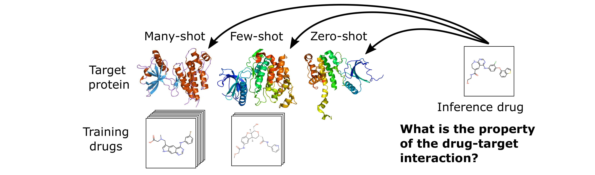

# HyperPCM

[](https://www.python.org/downloads/release/python-390/)
[](https://pytorch.org/get-started/previous-versions/)


**[Dependencies](#dependencies)**
| **[Data](#data)**
| **[Encoders](#encoders)**
| **[Usage](#usage)**
| **[Citation](#citation)**

### Robust task-conditioned modeling of drug-target interactions

Emma Svensson<sup>1</sup>, Pieter-Jan Hoedt<sup>1</sup>, Sepp Hochreiter<sup>1, 2</sup>, Günter Klambauer<sup>1</sup>

<sup>1</sup> ELLIS Unit Linz and LIT AI Lab, Institute for Machine Learning, Johannes Kepler University Linz, Austria  
<sup>2</sup> Institute of Advanced Research in Artificial Intelligence (IARAI) 

HyperNetworks (Schmidhuber, et al., 1992; Ha, et al., 2017) have been established as an effective technique to achieve 
fast adaptation of parameters for neural networks. 
Recently, HyperNetwork predictions conditioned on information about tasks have improved multi-task generalization in various domains, 
such as personalized federated learning and neural architecture search. Especially powerful results were achieved in 
few- and zero-shot settings, attributed to the increased information sharing by the multiplicative interactions in the 
HyperNetwork. With the rise of new diseases fast discovery of drugs is needed which requires models that are able to 
generalize the predicted properties of drug-target interactions in low-data scenarios. In this work, we propose the 
HyperPCM model, a task-conditioned HyperNetwork for the problem of predicting drug-target interactions in drug discovery. 
We demonstrate state-of-the-art performance over previous methods on multiple well-known benchmarks, particularly during 
zero-shot inference for unseen protein targets.

Workshop papers available on OpenReview from [NeurIPS 2022 AI4Science](https://openreview.net/forum?id=dIX34JWnIAL) and [ELLIS ML4Molecules 2022](https://openreview.net/forum?id=MrUwwGKRhOM).


Overview of the model architecture, including a) the context module proposed by Schimunek, et al. (2023) that enrich the 
embeddings of protein targets through an associative memory in the form of a Modern Hopfield Network, and b) the weight 
initialization strategy, PWI, proposed by Chang, et al. (2021). 
## Dependencies

Main requirements are,
- CUDA >= 11.1
- PyTorch >= 1.9

Additional packages: sklearn, [modern-hopfield-layers](https://github.com/emmas96/modern-hopfield-layers), PyTDC

**Logging** is supported with: wandb

**Data preparation** and drug/target encoding require: rdkit, [bio-embeddings](https://github.com/sacdallago/bio_embeddings), [cddd](https://github.com/jrwnter/cddd.git), [molbert](https://github.com/BenevolentAI/MolBERT)

Tabular baseline XGBoost requires: xgboost

## Data
Currently supported datasets are,
- **Lenselink**, et al. (2017) benchmark derived from [ChEMBL](https://www.ebi.ac.uk/chembl/). 
Prepared data with exact folds used is available in [data.pickle](hyper_dti/data/Lenselink/processed/data.pickle), use 
flag ```--data_dir hyper_dti/data``` to directly reproduce experiments on this dataset.
- **Davis**, et al. (2011) benchmark supplied through [Therapeutics Data Commons](https://tdcommons.ai/multi_pred_tasks/dti/#davis). 
Exact folds are automatically generated in the supplied data module.
- **KIBA** benchmark from Tang, et al. (2014) supplied through [Therapeutics Data Commons](https://tdcommons.ai/multi_pred_tasks/dti/#kiba). 
Exact folds are automatically generated in the supplied data module.

The HyperPCM model is specifically developed to work for few- and zero-shot inference as illustrated in the following figure. 


## Encoders
Currently supported encoders for drugs and targets reprecitvelly include the following pre-trained open-source models.
All drug encoders take the SMILES strings of the molecules as input and all target encoders take the amino-acid sequences 
of the proteins as input.

**Drugs**

- **CDDD**, Continuous and Data-Driven Descriptors proposed by Winter, et al. (2019) available at [github](https://github.com/jrwnter/cddd).
- **MolBERT**, Molecular representation learning with the BERT languange-model proposed by Fabian, et al. (2020) available at [github](https://github.com/BenevolentAI/MolBERT).

**Targets**

- **SeqVec** proposed by Heinzinger, et al. (2019) available through [bio_embeddings](https://github.com/sacdallago/bio_embeddings).
- **UniRep** proposed by Alley, et al. (2019) available through [bio_embeddings](https://github.com/sacdallago/bio_embeddings).
- **ProtBERT** proposed by Elnaggar, et al. (2021) available through [bio_embeddings](https://github.com/sacdallago/bio_embeddings).
- **ProtT5** proposed by Elnaggar, et al. (2021) available through [bio_embeddings](https://github.com/sacdallago/bio_embeddings).
- **ESM-1b** proposed by Rives, et al. (2021) available through [bio_embeddings](https://github.com/sacdallago/bio_embeddings).

## Usage
Use this repository to train and evaluate our HyperPCM model, or the baseline DeepPCM, with

```bash
$ python main.py --name experiment1 --architecture [model] --dataset [dataset] --split random --drug_encoder CDDD --target_encoder SeqVec
```
Optionally, specify `--wandb_username` to log runs in Weights & Biases and find other flags for hyperparameters and settings in [config.py](https://github.com/ml-jku/hyper-dti/blob/main/settings/config.py).

### Pre-compute embeddings
Embeddings for drug compounds and protein targets can either be computed directly during runtime or be prepared in advanced. 
To pre-compute them run the following script for the drug and target encoders of interest respectively. 
```bash
$ python precompute_embeddings.py --dataset Lenselink --input_type Drug --encoder_name CDDD
```

### Reproducibility
Reproduce full benchmarking of either the HyperPCM, DeepPCM, XGBoost, or RandomForest model 
for any pair of encoders in either of the four settings of the two benchmarks Lenselink or Davis using
```bash
$ python reproduce_experiments.py --model HyperPCM --dataset Lenselink --split leave-protein-out --drug_encoder CDDD --target_encoder SeqVec
```
Optionally, specify `--wandb_username` to log runs in Weights & Biases.

## Citation
```bibtex
@inproceedings{svensson2022robust,
    title={Robust task-specific adaption of drug-target interaction models},
    author={Svensson, Emma and Hoedt, Pieter-Jan and Hochreiter, Sepp and Klambauer, G\"{u}nter},
    booktitle={NeurIPS 2022 3d AI for Science Workshop},
    year={2022},
    url={https://openreview.net/forum?id=dIX34JWnIAL}
}
```

<i>Accepted oral,</i>

Svensson, E., Hoedt, P.-J., Hochreiter, S., Klambauer, G. Task-conditioned modeling of drug-target interactions. In
ELLIS Machine Learning for Molecule Discovery Workshop, 2022.

<i>Accepted posters,</i>

Svensson, E., Hoedt, P.-J., Hochreiter, S., Klambauer, G. Task-conditioned modeling of drug-target interactions. Poster presented at: Women in Machine Learning (WiML). Thirty-sixth Conference on Neural Information Processing Systems; 2022 Nov 28- Dec 9; New Orleans, LA.

Svensson, E., Hoedt, P.-J., Hochreiter, S., Klambauer, G. Robust task-specific adaption of drug-target interaction models. Poster presented at: Women in Machine Learning (WiML). Thirty-ninth International Conference on Machine Learning; 2022 Jun 17-23; Baltimore, MD.

## References

Schmidhuber, J., “Learning to control fast-weight memories: An alternative to dynamic recurrent networks.” Neural Computation, 1992.

Davis, M. I., et al. "Comprehensive analysis of kinase inhibitor selectivity." Nature Biotechnology 29.11 (2011): 1046-1051.

Tang, J., et al. "Making sense of large-scale kinase inhibitor bioactivity data sets: a comparative and integrative analysis." Journal of Chemical Information and Modeling 54.3 (2014): 735-743.

Lenselink, E. B., et al. "Beyond the hype: deep neural networks outperform established methods using a ChEMBL bioactivity benchmark set." Journal of Cheminformatics 9.1 (2017): 1-14.

Ha, D., et al. “HyperNetworks”. ICLR, 2017.

Alley, E. C., et al. "Unified rational protein engineering with sequence-based deep representation learning." Nature Methods 16.12 (2019): 1315-1322.

Chang, O., et al., “Principled weight initialization for hypernetworks.” International Conference on Learning Representations, 2019.

Heinzinger, M., et al. "Modeling aspects of the language of life through transfer-learning protein sequences." BMC Bioinformatics 20.1 (2019): 1-17.

Winter, R., et al. "Learning continuous and data-driven molecular descriptors by translating equivalent chemical representations." Chemical Science 10.6 (2019): 1692-1701.

Fabian, B., et al. "Molecular representation learning with language models and domain-relevant auxiliary tasks." Workshop for ML4Molecules (2020).

Elnaggar, A., et al. "ProtTrans: Toward understanding the language of life through self-supervised learning." IEEE Transactions on Pattern Analysis and Machine Intelligence 44 (2021): 7112–7127.

Rives, A., et al. "Biological structure and function emerge from scaling unsupervised learning to 250 million protein sequences." Proceedings of the National Academy of Sciences 118.15 (2021): e2016239118.

Kim, P. T., et al. "Unsupervised Representation Learning for Proteochemometric Modeling." International Journal of Molecular Sciences 22.23 (2021): 12882.

Schimunek, J., et al., “Context-enriched molecule representations improve few-shot drug discovery.” International Conference on Learning Representations, 2023.

## Keywords
HyperNetworks, zero-shot, Modern Hopfield Networks, deep learning, drug-target interaction prediction, proteo-chemometrics, drug discovery
