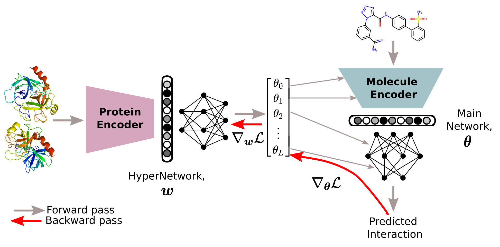

# HyperPCM

A HyperNetwork approach to drug-target interaction prediction.

**[Abstract](#abstract)**
| **[Dependencies](#dependencies)**
| **[Data](#data)**
| **[Citation](#citation)**

## Abstract

### Robust task-specific adaption of drug-target interaction models

Emma Svensson, Pieter-Jan Hoedt, Sepp Hochreiter, Günter Klambauer

HyperNetworks have been established as an effective technique to achieve fast adaptation of parameters for neural networks. Recently, HyperNetworks conditioned on descriptors of tasks have improved multi-task generalization in various domains, such as personalized federated learning and neural architecture search. Especially powerful results were achieved in few- and zero-shot settings, attributed to the increased information sharing by the HyperNetwork. Fast discovery of drugs is needed, which requires proteo-chemometric models that are able to generalize drug-target interaction (DTI) predictions in low-data scenarios. State-of-the-art methods apply a few fully-connected layers to concatenated learned embeddings of the protein target and drug compound. In this work, we develop a task-conditioned HyperNetwork approach for the problem of predicting drug-target interactions in drug discovery. We show that when model parameters are predicted for the fully-connected layers processing the drug compound embedding, based on the protein target embedding, predictive performance can be improved over previous methods. Three additional components of our architecture, a) switching to L1 loss, b) integrating a context module for proteins, and c) stable signal propagation, further boost performance and robustness. On an established benchmark for proteo-chemometrics models, our architecture outperforms previous methods in all settings, including few- and zero-shot settings. In an ablation study, we analyze the importance of each of the components of our HyperNetwork approach.

## Dependencies

Main requirements are,
- CUDA >= 11.4
- PyTorch >= 1.9
- Pytorch-Lightning >= 1.5 

Additional packages: rdkit, aidd-codebase, chemprop, bio-embeddings

Optionally supports: tensorboard and/or wandb

## Data
Datasets currently supported,
- PCM benchmark (Lenselink, 2017) derived from [ChEMBL](https://www.ebi.ac.uk/chembl/)

Will be expanded to benchmarks for binding affinity prediction,
- KIBA
- Davis

## Citation
TBA 

**Accepted posters,**

Svensson, E., Hoedt, P.-J., Hochreiter, S., Klambauer, G. Robust task-specific adaption of drug-target interaction models. Poster presented at: Women in Machine Learning (WiML). Thirty-sixth Conference on Neural Information Processing Systems; 2022 Nov 28- Dec 9; New Orleans, LA.

Svensson, E., Hoedt, P.-J., Hochreiter, S., Klambauer, G. Robust task-specific adaption of drug-target interaction models. Poster presented at: Women in Machine Learning (WiML). Thirty-ninth International Conference on Machine Learning; 2022 Jun 17-23; Baltimore, MD.

## References

Schmidhuber, J., “Learning to control fast-weight memories: An alternative to dynamic recurrent networks.” Neural Computation, 1992.

Lenselink, E. B., et al. "Beyond the hype: deep neural networks outperform established methods using a ChEMBL bioactivity benchmark set." Journal of cheminformatics 9.1 (2017): 1-14.

Ha, D., et al. “HyperNetworks”. ICLR, 2017.

Chang, O., et al., “Principled weight initialization for hypernetworks.” International Conference on Learning Representations, 2019.

Kim, P. T., et al. "Unsupervised Representation Learning for Proteochemometric Modeling." International Journal of Molecular Sciences 22.23 (2021): 12882.

Schimunek, J., et al., “Context-enriched molecule representations improve few-shot drug discovery.” OpenReview, to appear, 2022.

## Keywords
HyperNetworks, zero-shot, Modern Hopfield Networks, deep Learning, drug-target interaction prediction, proteo-chemometrics, drug discovery
