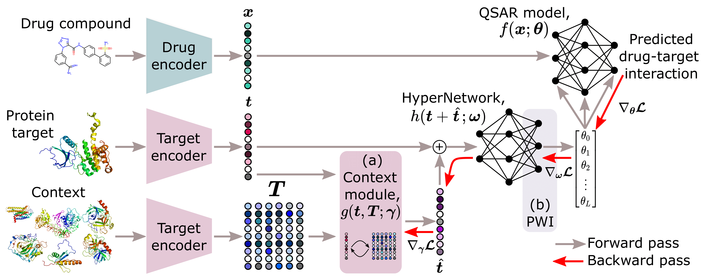

# HyperPCM

[](https://www.python.org/downloads/release/python-390/)
[](https://pytorch.org/get-started/previous-versions/)


**[Dependencies](#dependencies)**
| **[Installation](#installation)**
| **[Data](#data)**
| **[Encoders](#encoders)**
| **[Usage](#usage)**
| **[Citation](#citation)**

### Robust Task-Conditioned Modeling of Drug-Target Interactions

Emma Svensson<sup>1, 2</sup>, Pieter-Jan Hoedt<sup>1</sup>, Sepp Hochreiter<sup>1, 3</sup>, Günter Klambauer<sup>1</sup>

<sup>1</sup> ELLIS Unit Linz, Institute for Machine Learning, Johannes Kepler University Linz, 4040 Austria  
<sup>2</sup> Molecular AI, Discovery Sciences, R&D, AstraZeneca, Gothenburg, 431 83 Sweden\
<sup>3</sup> Institute of Advanced Research in Artificial Intelligence (IARAI), Vienna, 1030 Austria

A central problem in drug discovery is to identify the interactions between drug-like compounds and protein targets. Over the past decades, various quantitative structure-activity relationship (QSAR) and proteo-chemometric (PCM) approaches have been developed to model and predict these interactions. While QSAR approaches solely utilize representations of the drug compound, PCM methods incorporate both representations of the protein target and the drug compound, enabling them to achieve above-chance predictive accuracy on previously unseen protein targets. Both QSAR
and PCM approaches have recently been improved by machine learning and deep neural networks, that allow the development of drug-target interaction prediction models from measurement data. However, deep neural networks typically require large amounts of
training data and cannot robustly adapt to new tasks, such as predicting interaction for unseen protein targets at inference time. In this work, we propose to use HyperNetworks (Schmidhuber, et al., 1992; Ha, et al., 2017) to efficiently transfer information between tasks during inference and thus to accurately
predict drug-target interactions on unseen protein targets. Our HyperPCM model demonstrates state-of-the-art performance compared to previous methods on multiple
well-known benchmarks, including Davis, DUD-E, and a ChEMBL-derived dataset, particularly excelling in zero-shot inference involving unseen protein targets.

Read the full paper in [Journal of Chemical Information and Modeling](https://pubs.acs.org/doi/10.1021/acs.jcim.3c01417).
Workshop versions are also available on OpenReview from [NeurIPS 2022 AI4Science](https://openreview.net/forum?id=dIX34JWnIAL) and [ELLIS ML4Molecules 2022](https://openreview.net/forum?id=MrUwwGKRhOM).



Overview of the model architecture, including a) the context module proposed by Schimunek, et al. (2023) that enriches the 
embeddings of protein targets through an associative memory in the form of a Modern Hopfield Network, and b) the weight 
initialization strategy, PWI, proposed by Chang, et al. (2021). 
## Dependencies

Main requirements are,
- CUDA >= 11.1
- PyTorch >= 1.9

Additional packages: sklearn, [hopfield-layers](https://github.com/ml-jku/hopfield-layers), PyTDC

**Logging** is supported with: wandb

**Data preparation** and drug/target encoding require: rdkit, [bio-embeddings](https://github.com/sacdallago/bio_embeddings), [cddd](https://github.com/jrwnter/cddd.git), [molbert](https://github.com/BenevolentAI/MolBERT)

Tabular baseline XGBoost requires: xgboost

## Installation

The recommended way to install the software is to use `pip/pip3`:

```bash
$ pip3 install git+https://github.com/ml-jku/hopfield-layers
$ pip3 install git+https://github.com/ml-jku/hyper-dti
```

After installation, the HyperPCM model can be used by supplying the choice of drug_encoder (CDDD or MolBert) and target_encoder (SeqVec, UniRep, ProtBert, ProtT5, or ESM1b) as well as remaining arguments. If the context module should be used a memory, i.e. context, should also be provided.

```python
from hyper_dti.models.hyper_pcm import HyperPCM

hyperpcm = HyperPCM(
    drug_endorer='CDDD', 
    target_encoder='SeqVec', 
    args={
        'hyper_fcn': ..., # HyperNetwork
        'hopfield': ...,  # Context Module
        'main_cls': ...   # QSAR Model
    }
)
```

## Data
Currently supported datasets are,
- **Lenselink**, et al. (2017) benchmark derived from [ChEMBL](https://www.ebi.ac.uk/chembl/). 
Prepared data with exact folds for 10-fold cross-validation used is available in [data.pickle](hyper_dti/data/Lenselink/processed/data.pickle), use 
flag ```--data_dir hyper_dti/data``` to directly reproduce experiments on this dataset.
- **Davis**, et al. (2011) benchmark supplied through [Therapeutics Data Commons](https://tdcommons.ai/multi_pred_tasks/dti/#davis). 
Exact folds for 5-fold cross-validation are automatically generated in the supplied data module.
- **KIBA** benchmark from Tang, et al. (2014) supplied through [Therapeutics Data Commons](https://tdcommons.ai/multi_pred_tasks/dti/#kiba). 
Exact folds for 5-fold cross-validation are automatically generated in the supplied data module.
- **DUD-E**, the Database of Useful Decoys: Enhanced benchmark from Mysinger, et al. (2012), available at https://dude.docking.org/. Prepared data with exact folds for 3-fold cross-validation, as proposed in DrugVQA (Zheng, et al., 2020), is available in [data/DUDE](hyper_dti/data/DUDE/raw/). Use flag ```--data_dir hyper_dti/data``` to directly reproduce experiments on this dataset.

The HyperPCM model is specifically developed to work for few- and zero-shot inference as illustrated in the following figure. 


## Encoders
Currently supported encoders for drugs and targets respectively include the following pre-trained open-source models.
All drug encoders take the SMILES strings of the molecules as input and all target encoders take the amino-acid sequences 
of the proteins as input.

**Drugs**

- **CDDD**, Continuous and Data-Driven Descriptors proposed by Winter, et al. (2019) available at [github](https://github.com/jrwnter/cddd).
- **MolBERT**, Molecular representation learning with the BERT language model proposed by Fabian, et al. (2020) available at [github](https://github.com/BenevolentAI/MolBERT).

**Targets**

- **SeqVec** proposed by Heinzinger, et al. (2019) is available through [bio_embeddings](https://github.com/sacdallago/bio_embeddings).
- **UniRep** proposed by Alley, et al. (2019) is available through [bio_embeddings](https://github.com/sacdallago/bio_embeddings).
- **ProtBERT** proposed by Elnaggar, et al. (2021) is available through [bio_embeddings](https://github.com/sacdallago/bio_embeddings).
- **ProtT5** proposed by Elnaggar, et al. (2021) is available through [bio_embeddings](https://github.com/sacdallago/bio_embeddings).
- **ESM-1b** proposed by Rives, et al. (2021) is available through [bio_embeddings](https://github.com/sacdallago/bio_embeddings).

## Usage
Use this repository to train and evaluate our HyperPCM model, or the baseline DeepPCM, with

```bash
$ python main.py --name experiment1 --architecture [model] --dataset [dataset] --split random --drug_encoder CDDD --target_encoder SeqVec
```
Optionally, specify `--wandb_username` to log runs in Weights & Biases and find other flags for hyperparameters and settings in [config.py](https://github.com/ml-jku/hyper-dti/blob/main/settings/config.py).

### Pre-compute embeddings
Embeddings for drug compounds and protein targets can either be computed directly during runtime or be prepared in advance. 
To pre-compute them run the following script for the drug and target encoders of interest respectively. 
```bash
$ python precompute_embeddings.py --dataset Lenselink --input_type Drug --encoder_name CDDD
```

### Reproducibility
Reproduce full benchmarking of either the HyperPCM, DeepPCM, XGBoost, or RandomForest model 
for any pair of encoders in either of the four settings of the two benchmarks Lenselink or Davis using
```bash
$ python reproduce_experiments.py --model HyperPCM --dataset Lenselink --split leave-protein-out --drug_encoder CDDD --target_encoder SeqVec
```
Optionally, specify `--wandb_username` to log runs in Weights & Biases.

## Citation

Please cite our work using the following reference.
```bibtex
@article{svensson2024hyperpcm,
    title={{HyperPCM: Robust Task-Conditioned Modeling of Drug--Target Interactions}},
    author={Svensson, Emma and Hoedt, Pieter-Jan and Hochreiter, Sepp and Klambauer, G{\"u}nter},
    journal={Journal of Chemical Information and Modeling},
    volume = {64},
    number = {7},
    pages = {2539-2553},
    year = {2024},
    doi = {10.1021/acs.jcim.3c01417},
    publisher={ACS Publications}
}
```

<i>Accepted oral,</i>

Svensson, E., Hoedt, P.-J., Hochreiter, S., Klambauer, G. Task-conditioned modeling of drug-target interactions. In
ELLIS Machine Learning for Molecule Discovery Workshop, 2022.

<i>Accepted posters,</i>

Svensson, E., Hoedt, P.-J., Hochreiter, S., Klambauer, G. Task-conditioned modeling of drug-target interactions. Poster presented at: Women in Machine Learning (WiML). Thirty-sixth Conference on Neural Information Processing Systems; 2022 Nov 28- Dec 9; New Orleans, LA.

Svensson, E., Hoedt, P.-J., Hochreiter, S., Klambauer, G. Robust task-specific adaption of drug-target interaction models. Poster presented at: Women in Machine Learning (WiML). Thirty-ninth International Conference on Machine Learning; 2022 Jun 17-23; Baltimore, MD.

## Funding

This work has received funding from the European Union’s Horizon 2020
research and innovation programme under the Marie Skłodowska-Curie
Actions, grant agreement “Advanced machine learning for Innovative Drug
Discovery (AIDD)” No 956832”. [Homepage](https://ai-dd.eu/).


## References

Schmidhuber, J., “Learning to control fast-weight memories: An alternative to dynamic recurrent networks.” Neural Computation, 1992.

Davis, M. I., et al. "Comprehensive analysis of kinase inhibitor selectivity." Nature Biotechnology 29.11 (2011): 1046-1051.

Mysinger, M. M., et al. "Directory of useful decoys, enhanced (DUD-E): better ligands and decoys for better benchmarking." Journal of medicinal chemistry 55.14 (2012): 6582-6594.

Tang, J., et al. "Making sense of large-scale kinase inhibitor bioactivity data sets: a comparative and integrative analysis." Journal of Chemical Information and Modeling 54.3 (2014): 735-743.

Lenselink, E. B., et al. "Beyond the hype: Deep neural networks outperform established methods using a ChEMBL bioactivity benchmark set." Journal of Cheminformatics 9.1 (2017): 1-14.

Ha, D., et al. “HyperNetworks”. ICLR, 2017.

Alley, E. C., et al. "Unified rational protein engineering with sequence-based deep representation learning." Nature Methods 16.12 (2019): 1315-1322.

Chang, O., et al., “Principled weight initialization for hypernetworks.” International Conference on Learning Representations, 2019.

Heinzinger, M., et al. "Modeling aspects of the language of life through transfer-learning protein sequences." BMC Bioinformatics 20.1 (2019): 1-17.

Winter, R., et al. "Learning continuous and data-driven molecular descriptors by translating equivalent chemical representations." Chemical Science 10.6 (2019): 1692-1701.

Fabian, B., et al. "Molecular representation learning with language models and domain-relevant auxiliary tasks." Workshop for ML4Molecules (2020).

Zheng, S., et al. "Predicting drug–protein interaction using quasi-visual question answering system." Nature Machine Intelligence 2.2 (2020): 134-140.

Elnaggar, A., et al. "ProtTrans: Toward understanding the language of life through self-supervised learning." IEEE Transactions on Pattern Analysis and Machine Intelligence 44 (2021): 7112–7127.

Rives, A., et al. "Biological structure and function emerge from scaling unsupervised learning to 250 million protein sequences." Proceedings of the National Academy of Sciences 118.15 (2021): e2016239118.

Kim, P. T., et al. "Unsupervised Representation Learning for Proteochemometric Modeling." International Journal of Molecular Sciences 22.23 (2021): 12882.

Schimunek, J., et al., “Context-enriched molecule representations improve few-shot drug discovery.” International Conference on Learning Representations, 2023.

## Keywords
HyperNetworks, zero-shot, Modern Hopfield Networks, deep learning, drug-target interaction prediction, proteo-chemometrics, drug discovery
